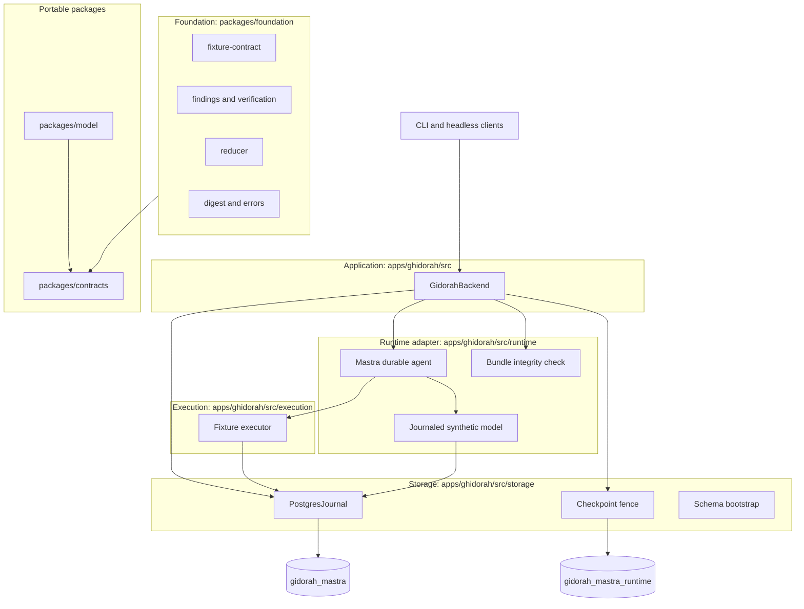

# Architecture

Ghidorah is the headless backend for Mettle. Mastra supplies the reusable agent loop. Ghidorah owns everything that loop must not be trusted with: admission, execution authority, budgets, ownership, the authoritative journal, evidence integrity and the ordered event stream a frontend renders. Ghidorah does not implement a second reasoning loop.

Today the executable path admits exactly one job: the synthetic counter fixture. Every other module in the tree is a hardened foundation for the production plan, not enabled behavior. See [the production plan](production-plan.md) for the gates.

## Layers

The repository is a Bun workspace. `packages/` holds libraries the frontend may also import; `apps/ghidorah` is the backend runtime; `apps/frontend` is the slot for the Mettle UI. Layers are organised by trust and dependency direction, and lower layers never import higher ones. Cross-package imports use the workspace names `@ghidorah/contracts`, `@ghidorah/foundation` and `@ghidorah/model`.

| Directory | Owns | Depends on |
| --- | --- | --- |
| `packages/contracts/src/` | Portable shared contracts: core 1.0.0 run/event/control schemas, Finding claims and receipts, Oracle 3.0.0 and registry 2.0.0 seams, ModelClient 1.0.0. Zod only, no Node or Postgres imports. Published as `@ghidorah/contracts`. | `zod` |
| `packages/model/src/` | Provider-neutral `ModelGateway`: one validated, journaled dispatch with bounded streams and usage accounting. `OpenRouterClient` is the first transport, pinned to one model and one upstream. Published as `@ghidorah/model`. Not yet wired into the fixture. | `apps/ghidorah/src/contracts` |
| `packages/foundation/src/` | Backend-side domain rules. `fixture-contract.ts` narrows the shared contract to the counter fixture. `findings.ts` and `verification.ts` add digest and authority checks a portable schema cannot express. `reducer.ts` projects events into frontend state. `digest.ts` is the canonical encoder every hash depends on. | `apps/ghidorah/src/contracts` |
| `apps/ghidorah/src/storage/` | `journal.ts` is the authoritative record: runs, leases, events, model calls, actions, artifacts. `model-dispatch-journal.ts` is the gateway's lease-fenced dispatch and usage record, layered on the run row. `checkpoint-fence.ts` installs the Postgres trigger that fences native Mastra snapshots by owner and epoch. `checkpoint-writes.ts` makes failed native saves fatal. `bootstrap.ts` creates marked schemas. | foundation |
| `apps/ghidorah/src/execution/` | `FixtureExecutor`: admission, intent, dispatch, effect and commit for a tool call. A model proposal is never execution authority. | storage |
| `apps/ghidorah/src/runtime/` | `mastra.ts` wires tools, model and storage into one durable agent and consumes its stream. `fixture-model.ts` records or replays the synthetic model. `integrity.ts` refuses to run on an unpatched Mastra bundle. | execution, storage |
| `apps/ghidorah/src/backend.ts` | Run lifecycle: validation, lease, heartbeat, wall-clock deadline, stop control, event polling, snapshots. The only entry point clients use. | everything above |

Supporting trees: `apps/ghidorah/test/` (unit, integration, recovery, comparison helpers), `apps/ghidorah/evals/` (100 catalogued cases with source fingerprints), `apps/ghidorah/scripts/` (Mastra patch installer, native recovery reproduction, OpenRouter acceptance), `packages/contracts/scripts/` and `packages/contracts/manifest.json` (contract drift manifest).

## One run

1. The client calls `run(target, config)`. `validateFixtureRun` rejects anything but the registered counter target, the synthetic model, closed-world approval and the exact scope allowlist.
2. The backend verifies the installed Mastra bundle hashes and the presence of the checkpoint fence before creating a run row.
3. It acquires a lease with an owner UUID and epoch, arms a heartbeat at one third of the TTL, and arms a wall-clock deadline from the persisted remaining budget.
4. Mastra starts, or recovers from a saved native snapshot. Native automatic recovery is off so Ghidorah's checks run first.
5. Each model call is keyed by conversation ordinal. `beginModel` either returns the committed response or records the request before dispatch. The synthetic model always proposes increment, then read, then finishes.
6. Each tool proposal passes through the executor: prepared, dispatched, effect applied, completed. Every transition is a fenced Postgres transaction that also appends events and charges budget.
7. The backend polls the journal and yields committed events in sequence order. A `run.finished` event or a terminal snapshot ends the stream. Nothing is reported that was not committed first.

The fixture leaves the counter at exactly one, records five steps and six synthetic tokens, and cannot emit a finding. The schema forces finding counts to zero.

## Recovery and the uncertainty rule

Recovery re-acquires a lease and calls `assertRecoverable`. Committed model responses and completed tool results replay from the journal with digest checks on stored artifacts.

The action state machine has one rule that everything else serves: an action that was dispatched without a committed result is uncertain, and recovery blocks instead of guessing.

| Fault point | State on disk | On recovery |
| --- | --- | --- |
| after-model | model response committed, no action | Resume; replay response |
| after-intent | action prepared | Resume; re-dispatch safely |
| after-dispatch | action dispatched, no effect recorded | Block |
| after-effect | effect applied, no completion | Block |
| after-result | action completed | Resume; reuse result |

Integration tests kill real worker processes at each point and assert this table.

## Ownership fencing

Two layers prevent a stale worker from advancing state after losing its lease.

- The journal checks owner and epoch inside every write transaction and throws `lease_lost`.
- The checkpoint fence is a Postgres trigger on the native Mastra snapshot table. Each execution connects with its run, owner and epoch as session settings. The trigger locks the run row and rejects writes from a wrong owner, a stale epoch, an expired lease, a terminal run, a different run or a foreign workflow name. Deletes and truncates are denied so recovery evidence survives.

This fences trusted workers against each other. It is not tenant isolation, and it does not protect against a database owner who can alter triggers.

## The Mastra patch

The dependency is `@mastra/core` 1.67.0 with a local, hash-pinned patch. Real kill tests exposed two upstream faults: restart picked the previous step's pruned output instead of the active step's saved input, and snapshot pruning discarded model output needed to merge tool results. The installer in `apps/ghidorah/scripts/mastra-recovery-patch.mjs` rewrites both bundles only when their original hashes match, and `apps/ghidorah/src/runtime/integrity.ts` refuses execution on any other bytes. Details and maintenance rules are in [the recovery fix](recovery-fix.md).

## Frontend boundary

Consumers render committed events and restore from snapshots. `applyEvent` in the reducer enforces contiguous sequence numbers, rejects cross-run events, duplicates and post-terminal transitions, and treats a validated snapshot as authoritative. Only `stop` is an accepted control; approvals, reviews, pause and resume are schema-defined but rejected at runtime.

## Verification surface

| Layer | Command | What it proves |
| --- | --- | --- |
| Formatting | `bun run format:check` | Prettier style across TypeScript, JavaScript and JSON |
| Types | `bun run typecheck` | Whole repo under strict settings |
| Contracts | `bun run contracts:check` | Shared schemas, validators and canonical encoder match the pinned manifest |
| Unit | `bun run test` | Contracts, reducer, findings admission, gateway, configuration policy |
| Recovery patch | `bun run test:recovery` | Patch installation, rejection and behavioral regression, offline |
| Integration | `bun run test:integration` | Real worker kills, fencing races, deadlines, failure handling |
| Evaluations | `bun run eval` | 100 catalogued cases with source fingerprints recorded |
| Native repro | `bun run repro:native` | Kill a native model-call process and recover from Postgres |
| Live model | `bun run acceptance:openrouter` | One pinned OpenRouter route through gateway and Postgres journal, capped spend |

`bun run verify` runs the whole pipeline. The contract manifest pins source hashes, so a formatting change to `packages/contracts/src/` or `packages/foundation/src/digest.ts` is an intentional manifest update, never an automatic refresh.

## Code style

Runtime is Bun 1.4 or newer; TypeScript runs directly with no build step, and `tsc` is used only for type checking. Prettier at 120 columns, double quotes, trailing commas. Configuration lives in `.prettierrc.json` and `.editorconfig`. Markdown and Compose files are excluded so tables and YAML keep their hand-set layout. Run `bun run format` before committing.

## Production gates

The architecture is a development foundation. Release still requires authenticated tenant and target authorization, an isolated execution broker, real model transport and durable usage accounting, integrated independent verification, durable approvals and findings, customer-data controls and sustained failure testing. The ordered list with acceptance criteria is in [the production plan](production-plan.md). A passing counter fixture is not production approval.
