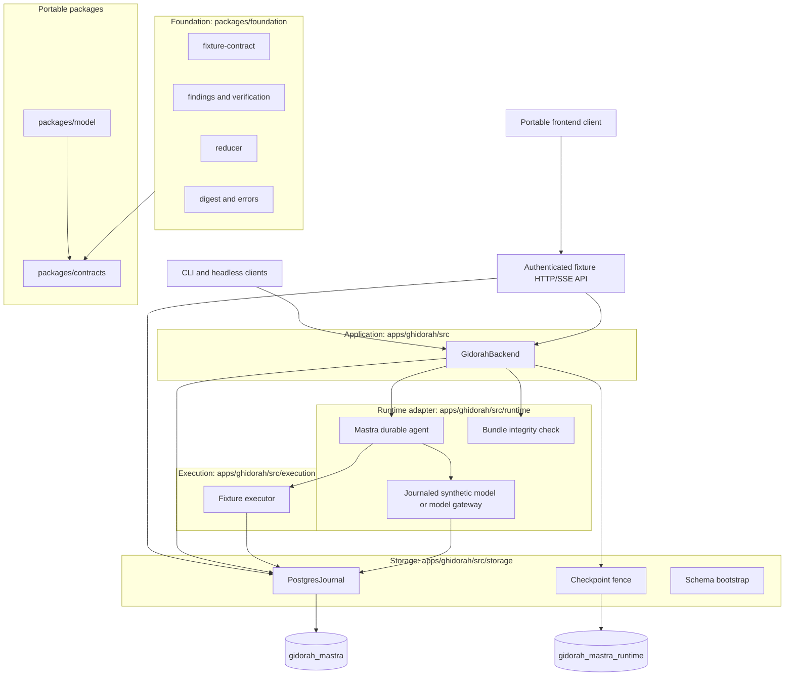

# Architecture

Ghidorah is the headless backend for Mettle. Mastra supplies the reusable agent loop. Ghidorah owns everything that loop must not be trusted with: admission, execution authority, budgets, ownership, the authoritative journal, evidence integrity and the ordered event stream a frontend renders. Ghidorah does not implement a second reasoning loop.

Today the executable path admits one target: the counter fixture. It can use a synthetic model or an explicitly pinned provider profile. An authenticated loopback HTTP/SSE adapter and portable client expose this same fixture, not customer targets. See [the production plan](production-plan.md) for the gates.

## Layers

The repository is a Bun workspace. `packages/` holds libraries the frontend may also import; `apps/ghidorah` is the backend runtime; `apps/frontend` is the slot for the Mettle UI. Layers are organised by trust and dependency direction, and lower layers never import higher ones. Cross-package imports use the workspace names `@ghidorah/contracts`, `@ghidorah/foundation` and `@ghidorah/model`.

| Directory | Owns | Depends on |
| --- | --- | --- |
| `packages/contracts/src/` | Portable shared contracts: core 1.0.0 run/event/control schemas, Finding claims and receipts, Oracle 3.0.0 and registry 2.0.0 seams, ModelClient 1.0.0. Zod only, no Node or Postgres imports. Published as `@ghidorah/contracts`. | `zod` |
| `packages/model/src/` | Provider-neutral `ModelGateway`: one validated, journaled dispatch with bounded streams and usage accounting. `OpenRouterClient` is the first transport, pinned to one model and explicit upstreams. Published as `@ghidorah/model` and wired into the optional counter profile. | `@ghidorah/contracts` |
| `packages/foundation/src/` | Backend-side domain rules. `fixture-contract.ts` narrows the shared contract to the counter fixture. `findings.ts` and `verification.ts` add digest and authority checks a portable schema cannot express. `reducer.ts` projects events into frontend state. `digest.ts` is the canonical encoder every hash depends on. | `@ghidorah/contracts` |
| `apps/ghidorah/src/storage/` | `journal.ts` is the authoritative record: runs, leases, events, model calls, actions, artifacts. `model-dispatch-journal.ts` is the gateway's lease-fenced dispatch and usage record, layered on the run row. `checkpoint-fence.ts` installs the Postgres trigger that fences native Mastra snapshots by owner and epoch. `checkpoint-writes.ts` makes failed native saves fatal. `bootstrap.ts` creates marked schemas. | foundation |
| `apps/ghidorah/src/execution/` | `FixtureExecutor`: admission, intent, dispatch, effect and commit for a tool call. A model proposal is never execution authority. | storage |
| `apps/ghidorah/src/runtime/` | `mastra.ts` wires tools, model and storage into one durable agent and consumes its stream. `fixture-model.ts` records or replays the synthetic model. `gateway-model.ts` adapts Mastra's model interface to the gateway for a real route; `model-profile.ts` pins that route into the run's runtime version. `integrity.ts` refuses to run on an unpatched Mastra bundle. | execution, storage, model |
| `apps/ghidorah/src/backend.ts` | Run lifecycle: validation, lease, heartbeat, wall-clock deadline, stop control, event polling, snapshots. Privileged in-process application API. | runtime, storage, foundation |
| `apps/ghidorah/src/api/` | Verified-principal authority binding, process-local background supervision, idempotent start, committed SSE polling and authorized stop/artifact access. | backend, storage, contracts |
| `apps/frontend/src/client.ts` | Portable asynchronous HTTP/SSE client; no renderer or authority to confirm findings. | `@ghidorah/contracts` |

Supporting trees: `apps/ghidorah/test/` (unit, integration, recovery, comparison helpers), `apps/ghidorah/evals/` (100 catalogued cases with source fingerprints), `apps/ghidorah/scripts/` (Mastra patch installer, native recovery reproduction, OpenRouter acceptance), `packages/contracts/scripts/` and `packages/contracts/manifest.json` (contract drift manifest).

## One run

1. The client starts a run. `validateCounterRun` rejects anything but the registered counter target, the synthetic/default or explicitly pinned model, closed-world approval and the exact scope allowlist. The HTTP path binds authenticated tenant/actor/engagement/policy authority before allocation; trusted in-process callers remain privileged.
2. The backend verifies the installed Mastra bundle hashes and the presence of the checkpoint fence before creating a run row.
3. It acquires a lease with an owner UUID and epoch, arms a heartbeat at one third of the TTL, and arms a wall-clock deadline from the persisted remaining budget.
4. Mastra starts, or recovers from a saved native snapshot. Native automatic recovery is off so Ghidorah's checks run first.
5. Each model call is keyed by conversation ordinal. The synthetic model uses `beginModel`; a provider profile uses the finalized-output gateway and `model_dispatches` journal. Both capture immutable request identity and replay committed responses rather than making a second call. An unresolved provider reservation blocks recovery until reconciliation.
6. Each tool proposal passes through the executor: prepared, dispatched, effect applied, completed. Every transition is a fenced Postgres transaction that also appends events and charges budget.
7. The backend polls the journal and yields committed events in sequence order. A `run.finished` event or a terminal snapshot ends the stream. Nothing is reported that was not committed first.

The deterministic synthetic fixture leaves the counter at exactly one and records five steps/six synthetic tokens. The gateway test transport records 48 provider-reported test tokens across three calls. A real model's actions/usage are not assumed to equal either fixture. No path can emit a finding yet; fixture finding counts stay zero.

## Recovery and the uncertainty rule

Recovery re-acquires a lease and calls `assertRecoverable`. Committed model responses and completed tool results replay from the journal with digest checks on stored artifacts.

The action state machine has one rule that everything else serves: an action that was dispatched without a committed result is uncertain, and recovery blocks instead of guessing.

| Fault point | State on disk | On recovery |
| --- | --- | --- |
| after-model | model response committed, no action | Resume; replay response |
| after-intent | action prepared | Resume; re-dispatch safely |
| after-dispatch | action dispatched, no effect recorded | Block |
| after-effect | effect applied, no completion | Block |
| after-result | action completed | Resume; reuse result |

Integration tests kill real worker processes at each point and assert this table.

## Ownership fencing

Two layers prevent a stale worker from advancing state after losing its lease.

- The journal checks owner and epoch inside every write transaction and throws `lease_lost`.
- The checkpoint fence is a Postgres trigger on the native Mastra snapshot table. Each execution connects with its run, owner and epoch as session settings. The trigger locks the run row and rejects writes from a wrong owner, a stale epoch, an expired lease, a terminal run, a different run or a foreign workflow name. Deletes and truncates are denied so recovery evidence survives.

This fences trusted workers against each other. It is not tenant isolation, and it does not protect against a database owner who can alter triggers.

## The Mastra patch

The dependency is `@mastra/core` 1.67.0 with a local, hash-pinned patch. Real kill tests exposed three faults: wrong restart input, pruned model output needed to merge tool results, and a recovered model registry missing its tools. The installer verifies all four ESM/CommonJS bundles before changing any; runtime integrity refuses unaccepted bytes. Details and maintenance rules are in [the recovery fix](recovery-fix.md).

## Frontend boundary

Consumers render committed events and restore from snapshots. `applyEvent` in the reducer enforces contiguous sequence numbers, rejects cross-run events, duplicates and post-terminal transitions, and treats a validated snapshot as authoritative. Only `stop` is an accepted control; approvals, reviews, pause and resume are schema-defined but rejected at runtime.

The [fixture API](product-api.md) runs work independently of a frontend subscription. Its journal poller supports a second API process; disconnecting does not stop a job. HTTP requests cannot choose their own tenant/actor authority. This scoped adapter is not SSO, RLS, a distributed scheduler or a complete frontend.

## Verification surface

| Layer | Command | What it proves |
| --- | --- | --- |
| Formatting | `bun run format:check` | Prettier style across TypeScript, JavaScript and JSON |
| Types | `bun run typecheck` | Whole repo under strict settings |
| Contracts | `bun run contracts:check` | Shared schemas, validators and canonical encoder match the pinned manifest |
| Unit | `bun run test` | Contracts, reducer, findings admission, gateway, configuration policy |
| Recovery patch | `bun run test:recovery` | Patch installation, rejection and behavioral regression, offline |
| Integration | `bun run test:integration` | Real worker kills, fencing races, deadlines, failure handling |
| Evaluations | `bun run eval` | 100 catalogued cases with source fingerprints recorded |
| Native repro | `bun run repro:native` | Kill a native model-call process and recover from Postgres |
| Restore drill | `bun run ops:restore-drill` | Restore all fixture/checkpoint tables into a new database and recover an interrupted gateway-backed job |
| Live model | `bun run acceptance:openrouter` | One pinned OpenRouter route through gateway and Postgres journal, capped spend |

`bun run verify` runs the offline/database suites and native reproduction, not paid model calls or the separate restore drill. The contract manifest pins source hashes, so a formatting change to `packages/contracts/src/` or `packages/foundation/src/digest.ts` is an intentional manifest update, never an automatic refresh.

## Code style

Runtime is Bun 1.4 or newer; TypeScript runs directly with no build step, and `tsc` is used only for type checking. Prettier at 120 columns, double quotes, trailing commas. Configuration lives in `.prettierrc.json` and `.editorconfig`. Markdown and Compose files are excluded so tables and YAML keep their hand-set layout. Run `bun run format` before committing.

## Production gates

The architecture is a development foundation. Release still requires customer identity/target authorization, an isolated execution broker and real tools, accepted live model failure/cost accounting, integrated independent verification, object evidence storage, durable approvals/findings/reports, the real frontend, monitoring and sustained failure testing. The ordered list with acceptance criteria is in [the production plan](production-plan.md) and [operations](operations.md). A passing counter fixture is not production approval.
