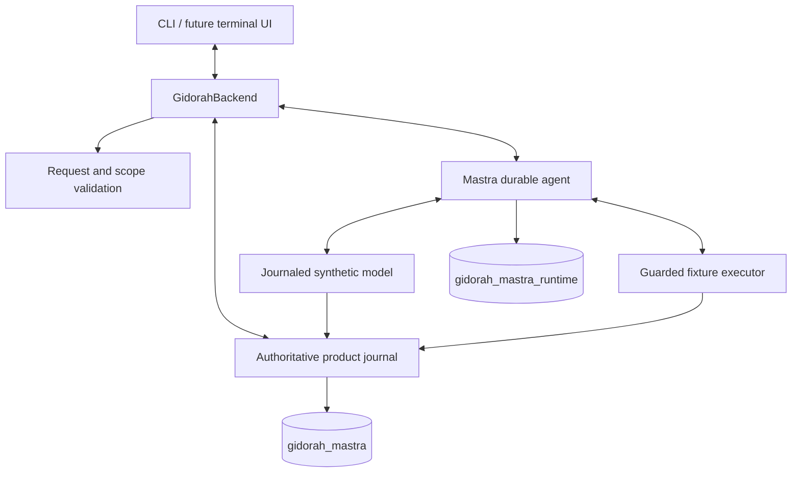

# Architecture

## Ownership

Mettle is the product; Gidorah is its headless backend; Mastra supplies the reusable agent loop. Gidorah does not implement a separate reasoning loop.

Both schemas are in the explicitly selected local PostgreSQL database. Everything else is currently in one Node.js application, not a deployed fleet of services.

| Component | Responsibility |
| --- | --- |
| `src/backend.ts` | Run lifecycle, leases, stop controls, snapshots and event observation |
| `src/foundation/` | Strict versioned contracts, canonical digests, frontend state projection and safe errors |
| `src/runtime/mastra.ts` | Wire Mastra tools/model/storage, consume streams and fail on runtime errors |
| `src/runtime/fixture-model.ts` | Record or replay synthetic model responses and their usage |
| `src/execution/fixture-executor.ts` | Check tool proposals, arguments, ownership and budgets before execution |
| `src/storage/journal.ts` | Persist runs, attempts, events, usage and digest-checked artifacts |
| `src/storage/bootstrap.ts` | Initialize marked fixture schemas and connect native Mastra checkpoint storage |
| `scripts/mastra-recovery-patch.mjs` | Install and verify the pinned upstream-bundle patch |

## One job

1. The CLI submits the registered counter fixture and explicit limits.
2. Gidorah validates the request, records the run and acquires a worker lease.
3. Mastra asks the synthetic model for the next step.
4. A model tool proposal is recorded; it is not itself execution authority.
5. The executor checks admission, records intent/dispatch, performs the counter operation and commits the result.
6. Mastra receives that result and continues until the fixture finishes or a limit/stop/error intervenes.
7. Clients receive ordered committed events and can restore their view from a snapshot.

The fixture increments once, reads once, then finishes. Finding counts remain zero; it cannot claim a vulnerability.

## Recovery and integrity

Recovery validates stored versions and obtains a fresh lease before allowing native recovery. Committed model responses and completed tool results are reused, with digest checks on stored evidence. An action dispatched without a committed result is uncertain: recovery blocks instead of guessing or repeating it.

The pinned Mastra patch restores the active step's saved input and retains model output required to merge tool results. It does not repair already-damaged old snapshots. Native automatic recovery is disabled so Gidorah can perform its safety checks first.

Journal updates are fenced by owner/epoch checks. This does **not** yet prove that all native checkpoint writes are fenced against stale workers. Manual fixture recovery is not automatic multi-worker scheduling or external exactly-once execution.

## Frontend boundary

The current consumer is a CLI or in-process client. A complete terminal UI, authenticated network API, reconnect protocol and durable event-delivery service are not implemented. The frontend must display backend records rather than infer success from model prose.

## Production work still required

- Prevent stale workers from advancing authoritative native checkpoints.
- Authenticate users, isolate tenants and enforce independently established target authorization.
- Add a sandboxed execution broker with controlled network access and reliable cleanup.
- Integrate real models with correct streaming, cancellation, retry and usage accounting.
- Independently verify evidence and findings; do not let the investigating model grade itself.
- Build reliable client transport, persisted approval/review workflows, monitoring and backup/restore.
- Run sustained failure, concurrency and security acceptance on dedicated infrastructure.

The architecture is a development foundation, not a production-readiness claim.
